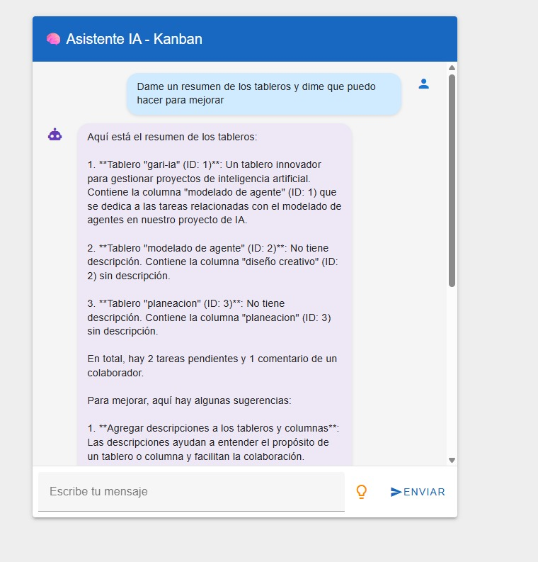
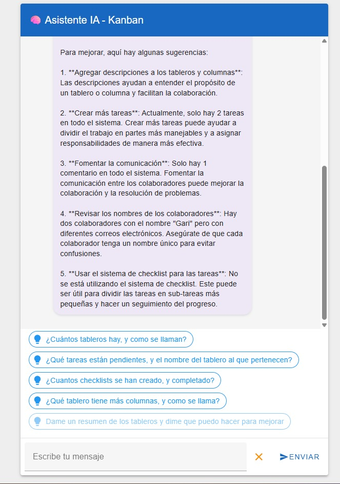

# 🧠 Agent AI Kanban

Agente con inteligencia artificial que interactúa con bases de datos para realizar operaciones CRUD y análisis detallados utilizando lenguaje natural, todo dentro de un Chat simple.

Adicionalmente se puede conectar vía chat de Whatsapp ( ej: Twilio)

## 📌 Descripción

**Agent AI Kanban** es una aplicación que combina una interfaz intuitiva estilo Chat con un agente de IA capaz de comprender y ejecutar instrucciones en lenguaje natural. Esta herramienta permite a los usuarios:

- Consultar y crear registros en bases de datos mediante lenguaje natural.
- Visualizar tareas y operaciones en un tablero Kanban.
- Obtener análisis y reportes detallados sin necesidad de escribir código SQL.

## 🚀 Características

- ✅ Interacción en lenguaje natural.
- ✅ Tablero Kanban interactivo.
- ✅ Generación de reportes automáticos.
- ✅ Operaciones CRUD con IA.

## 🖼️ Capturas de pantalla



_Ejemplo de una consulta realizada en lenguaje natural y su resultado._

## ⚙️ Tecnologías utilizadas

- **Frontend**: Vue.js
- **Backend**: Python (FastAPI)
- **Base de datos**: SQLite
- **IA**: OpenAI GPT / LangChain

## 📦 Instalación

```bash
# Clona el repositorio
git clone https://github.com/luisrapalino/agent-ai-kanban.git
cd agent-ai-kanban
```

## 🔧 Backend

```bash
python -m venv venv
cd backend
source venv/bin/activate # En Windows: venv\Scripts\activate
pip install -r requirements.txt
uvicorn main:app --reload # api CRUD
uvicorn main_api:app --reload --port 5000 # api Chat frontend
uvicorn whatsapp_api:app --reload --port 3000 # api Chat vía whatsapp (opcional)
```

## 💻 Frontend

```bash
cd frontend
npm install
npm run serve
```

Accede a la app en http://localhost:8080

## 🧪 Ejemplo de uso

Consulta:

Crea un tablero llamado Desarrollo web con una descripción profesional.

Respuesta:

Se ha creado el tablero "Desarrollo web" con la siguiente descripción "...".

## 🧠 IA en acción

El agente analiza instrucciones en lenguaje natural, las convierte en consultas estructuradas y devuelve los resultados directamente en el tablero. Esto reduce la necesidad de interacción técnica con la base de datos.

## 🙌 Contribuciones

¡Las contribuciones son bienvenidas! Sigue estos pasos:

- Haz un fork del repositorio.

- Crea una rama con tu funcionalidad: git checkout -b feature/nueva-funcionalidad

- Realiza tus cambios y haz commit: git commit -m 'Agrega nueva funcionalidad'

- Sube tus cambios: git push origin feature/nueva-funcionalidad

- Abre un Pull Request.

📬 Contacto
GitHub: @luisrapalino

Correo: luisrapalino88@gmail.com
